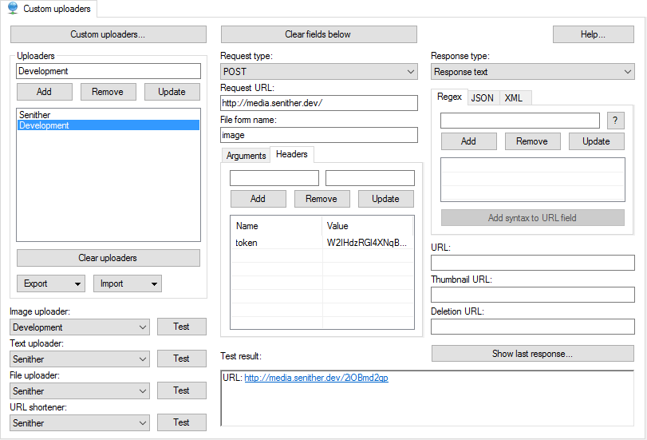

ShareX Media Server
===================

*ShareX Media Server* is a simple image shareing website, that utilizes [ShareX](https://getsharex.com/) and [Laravel](http://laravel.com/) to share screenshots with the world. The project was created for myself, since my old media server ran on a "slighty" old version of my own framework.

You're welcome to use this project for your own purpose, on your own server.

#### Server Requirements

 - PHP >= 5.5.9
 - PDO PHP Extension
 - Fileinfo PHP Extension
 - Mbstring PHP Extension
 - Tokenizer PHP Extension

#### Installing ShareX Media Server

Installing the media server is made super easy with composer, simply clone the repository to the folder you want it in:

    git clone https://github.com/Senither/ShareX-Media-Server.git .

Then install all the dependencies using composer:

    composer install

Next you'll need to generate a unique key, you can do this using Laravels artisan helper command.

    php artisan key:generate

Once everything is installed, open up the **.env** file and update the database values to match your database settings, once that is done you can migrate and seed the database to get the last few bits up and running.

    php artisan migrate --seed

You're now ready to start using the media server, however if you want the images to automatically be deleted after they expire you'll need to make a cronjob that runs every minute that runs Laravels scheduler.

    * * * * * php /path/to/project/artisan schedule:run

And you're done with all of the setup, you can now login to the control panel using the admin account, once you're logged in you can change your username, password and even make new accounts.
The admin login details are:

 * __Username:__ admin
 * __Password:__ secret

> **Tip:** Make sure that Laravel can read and write to the *storage* folder, this is required both for Laravel to work correctly, and for the media server to store the images that are uploaded.

#### Setting up ShareX

To get started, navigate to: *Destinations* -> *Destination Settings* -> *Custom uploaders*

Create a new custom uploader and set the *Request URL* to the root of your website, and the _Request type_ to POST, next create a new header with the _token_ key, and the token value from the control panel, it should look something like this. 

#### License

The ShareX Media Server open-sourced software licensed under the [MIT license](http://opensource.org/licenses/MIT).